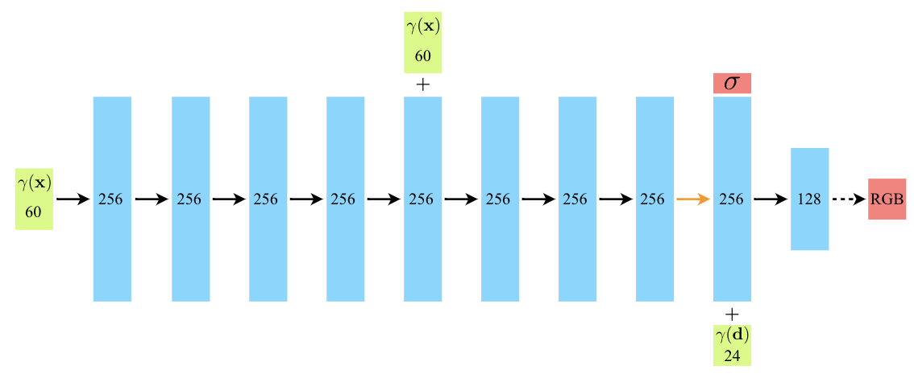

## KAIST Geometric AI Lab - Tutorial 2
Instructor: [Minhyuk Sung](https://mhsung.github.io/) (mhsung@kaist.ac.kr)

Session Host: **Seungwoo Yoo** (Lead), **Kunho Kim** (Support)

Last Updated: Jun 27, 2023.

If you have any questions, feel free to reach us via Slack.

## NeRF: 3D Reconstruction from 2D Images

<p align="middle">
  
</p>

The introduction of [Neural Radiance Fields (NeRF)](https://arxiv.org/abs/2003.08934) in 2020 was a huge milestone in image-based, neural rendering literature.
Compared with previous works on novel view synthesis, NeRF is a simple, yet powerful idea that combines recently emerging neural implicit representations with traditional volume rendering techniques.
As of today, the follow-up research aiming to scale and extend the idea to various tasks has become one of the largest stream in computer vision community thanks to its simplicity and versatility.

This week, we will take a technical deep dive into NeRF to gain understanding of this ground-breaking approach which will help us navigate a broader landscape of the field.
We strongly recommend you to check out the paper, together with [our brief summary](), before starting working on the tasks.

## Project Structure
This codebase is organized as the following directory tree. We only list the core components for brevity:
```
torch_nerf
│
├── configs             <- Directory containing config files
│
├── runners
│   ├── evaluate.py     <- Script for quantitative evaluation.
│   ├── render.py       <- Script for rendering (i.e., qualitative evaluation).
│   ├── train.py        <- Script for training.
│   └── utils.py        <- A collection of utilities used in the scripts above.
│
├── src
│   ├── cameras
│   │   ├── cameras.py
│   │   └── rays.py
│   │   
│   ├── network
│   │   └── nerf.py
│   │
│   ├── renderer
│   │   ├── integrators
│   │   ├── ray_samplers
│   │   └── volume_renderer.py
│   │
│   ├── scene
│   │
│   ├── signal_encoder
│   │   ├── positional_encoder.py
│   │   └── signal_encoder_base.py
│   │
│   └── utils
│       ├── data
│       │   ├── blender_dataset.py
│       │   └── load_blender.py
│       │
│       └── metrics
│           └── rgb_metrics.py
│
├── environment.yaml    <- Dependency configuration file.
└── README.md           <- This file.
```

## Environment Setup

We recommend configuring a virtual environment using `conda`.
To create a `conda` environment and install dependencies, issue the following command:
```
conda env create --file environment.yaml
```

To download the dataset for training, issue the following command:
```
sh scripts/data/download_example_data.sh
```
This should create `data` directory under the project root (`torch-NeRF` by default) and download datasets.

Register the project root directory (i.e., `torch-NeRF`) as an environment variable to help Python interpreter search our files.
```
export PYTHONPATH=.
```

By default, the configuration is set for `lego` scene included in `Blender` dataset. Refer to the config files under `config` for more details. Executing the following initiates training:
```
python torch_nerf/runners/train.py
```
All by-products produced during each run, including TensorBoard logs, will be saved under an experiment directory under `outputs`. This is automatically done by [Hydra](https://hydra.cc), the library we use for managing our config files. Refer to [the official documentation](https://hydra.cc/docs/intro/) for examples and APIs.

After training NeRF, it can be rendered using script `render.py.`
To do so, provide the experiment directory created when running the training script. For instance,
```
python torch_nerf/runners/render.py +log_dir=outputs/2023-06-27/00-10-15 +render_test_views=False
```
The Boolean flag `render_test_views` determines whether to render the trained scene from the viewpoints held out for testing. We will come back to this when discussing quantitative evaluation.

## Tasks

### Task 1. Implementing MLP
<p align="middle">
  
</p>

```bash
#! files-to-modify
$ torch_nerf/src/network/nerf.py
```
Implement the MLP displayed above. The network consists of:

1. One input fully-connected layer;
2. Nine fully-connected layers (including the one for skip connection);
3. One output fully-connected layer.

For details, such as the activation functions placed between hidden layers and used to produced outputs ($\sigma$, $\texttt{RGB}$), refer to Sec. A of the supplementary material.

### Task 2. Implementing Ray Sampling
```bash
#! files-to-modify
$ torch_nerf/src/cameras/rays.py
$ torch_nerf/src/renderer/ray_samplers/stratified_sampler.py
```
This task consists of two sub-tasks:

1. Implement the body of function `compute_sample_coordinates`.
This function will be used to evaluate the coordinates of points along rays casted from image pixels.
For a ray $r$ parameterized by the origin $\mathbf{o}$ and direction $\mathbf{d}$ (not necessarily a unit vector), a point on the ray can be computed by

```math
r(t) = \mathbf{o} + t \mathbf{d},
```
where $t \in [t_n, t_f]$ is bounded by the near bound $t_n$ and the far bound $t_f$, respectively.

3. Implement the body of function `sample_along_rays_uniform`.
The function implements the stratified sampling illustrated in the following equation (Eqn 2. in the paper).

```math
t_i \sim \mathcal{U} \left[ t_n + \frac{i-1}{N} \left( t_f - t_n \right), t_n + \frac{i}{N} \left( t_f - t_n \right) \right].
```

### Task 3. Implementing Volume Rendering Equation
```bash
#! files-to-modify
$ torch_nerf/src/cameras/rays.py
$ torch_nerf/src/renderer/integrators/quadrature_integrator.py
```
This task consists of two sub-tasks:

1. Implement the body of function `compute_deltas`.
As mentioned in the paper, $\delta_i = t_{i+1} - t_i$'s are necessary when using the quadrature rule to approximate the integral in the volume rendering equation.

2. Implement the body of function `integrate_along_rays`.
The function implements Eqn. 3 in the paper which defines a pixel color as a weighted sum of radiance values collected along a ray:

```math
\hat{C} \left( r \right) = \sum_{i=1}^T T_i \left( 1 - \exp \left( -\sigma_i \delta_i \right) \right) \mathbf{c}_i,
```
where 
```math
T_i = \exp \left( - \sum_{j=1}^{i-1} \sigma_j \delta_j \right).
```

### Task 4. Implementing Positional Encoding
```bash
#! files-to-modify
$ torch_nerf/src/signal_encoder/positional_encoder.py
```

Implement the body of function `_create_embedding_fn`.
The function implements the positional encoding used to lift 3D position vectors and view direction vectors to 63 and 27 dimensional space, respectively.
The definition of the positional encoding is as follows:

```math
\gamma (p) = \left( \sin \left( 2^0 p \right), \cos \left( 2^0 p \right), \cdots, \sin \left( 2^{L-1} \right), \cos \left( 2^{L-1} \right) \right),
```
where $L$ is the number of sinusoidal frequencies. Note that $\pi$ in Eqn 4. of the paper is often omitted in practice.
Refer to [the author's comment](https://github.com/bmild/nerf/issues/12) for details.

### Task 5. Quantitative \& Quantitative Evaluation

For qualitative evaluation, render the trained scene with the provided script. 
```
python torch_nerf/runners/render.py +log_dir=${PATH_TO_LOG_DIR} +render_test_views=False
```
This will produce a set of images rendered while orbitting around the upper hemisphere of an object.

For quantitative evaluation, render the trained scene again, **but from the test views**.
```
python torch_nerf/runners/render.py +log_dir=${PATH_TO_LOG_DIR} +render_test_views=True
```
This will produce 200 images (in the case of synthetic dataset) held out during training.
After rendering images from the test view, use the script `evaluate.py` to compute PSNR, LPIPS, and SSIM. For instance, to evaluate the implementation for `lego` scene:
```
python torch_nerf/runners/evaluate.py ${PRED_IMG_DIR} ./data/nerf_synthetic/lego/test
```

### Task 4 (Optional) Train NeRF with Your Own Data

Instead of using the provided dataset, capture your surrounding environment and use the data for training.
[COLMAP](https://github.com/colmap/colmap) might be useful when computing the relative camera poses.

### Task 5 (Optional) Extension to Follow-Ups

Coming Soon.

## Further Readings

Coming Soon.